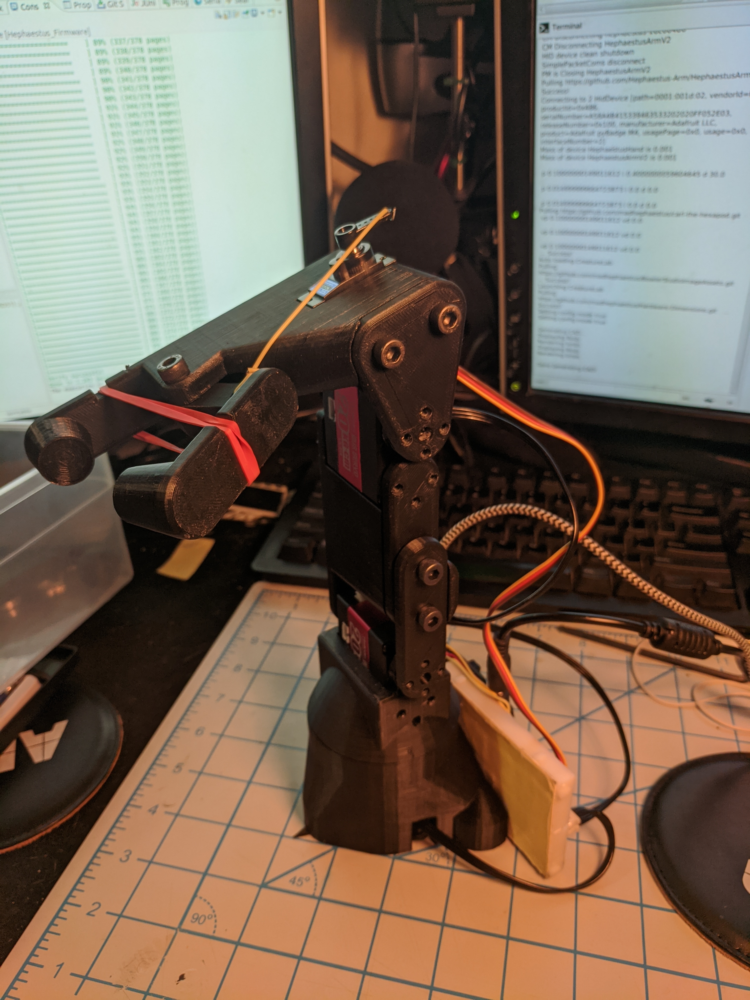

+++
author = "Tian Yu Fan"
title = "Catch-22"
date = "2022-10-01"
description = "Kinematics, trajectory planning, and computer vision for pick-and-place sorting sytem"
tags = []
categories = []
series = ["Unified Robotics"]
aliases = []
image = "Arm.jpg"
+++

The main objective of this project was to implement forward & inverse kinematics, velocity control, trajectory planning, and computer vision pipelines to pick-and-sort objects of different colors. 

# Tools
Software | Description
--------|------
Ubuntu 18.04 | Operating System
MATLAB | Software Framework
OpenCV | Computer Vision Toolbox

# Hardware
We used the Hephaestus-Arm, a 3-DOF serial arm with an ItsyBitsy control. Smart Servos actuated the robot with integrated encoders for positional feedback. A camera mounted on a stand captured the locations of the colored balls. 

# Software
## Computer Vision Pipeline
The camera captured a snapshot of the field for ball detection. We undistorted the image because the camera output was fisheye, rescaling the extremities of the frame. The resulting image captures regions outside the workspace, so we masked these areas. 

We defined a saturation threshold to detect the location of colorful objects within the camera frame. The pipeline eroded this resulting image to sharpen edges and reduce noise. Blob analysis calculated bounding boxes contouring the colorful balls from the eroded output image. 

We determined hue ranges that categorized orange, yellow, green, and pink balls. The center pixel of each bounding box decided the color of the ball. 

## Ball positioning
The objective is to convert the location of each ball into the frame defining the arm's base. This conversion facilitates kinematic operations with the robot arm. 

We used the MATLAB calibration tool to obtain the transformation between the pixel location of a ball and its position within the camera frame. The camera's position to the fixed frame defined on the checkboard is known. The robot arm's base frame is also known relative to the checkerboard frame. The ball's location to the robot base is the product of all these transformation matrices. 

## Inverse Kinematics
The inverse kinematics is the process of calculating the actuator states based on the actuator position. We employed a geometric approach to estimate the rotational value of the three joints. 

## Actuation
We actuated the arm to the previously calculated positions. The end-effector grasped a ball on the field and relocated it based on color.