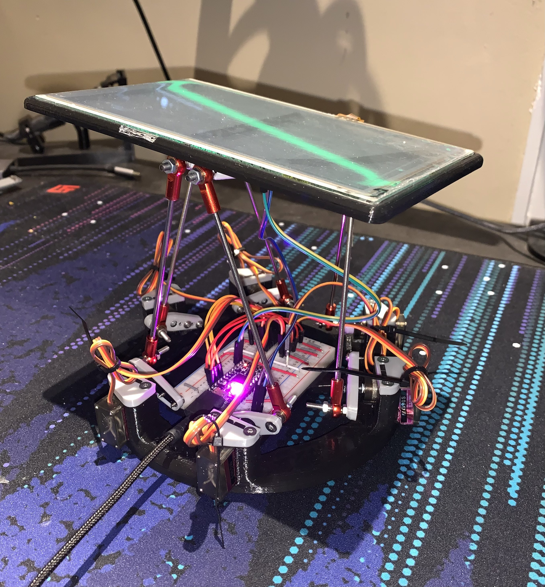

+++
author = "Tian Yu Fan"
title = "Stewart Gough Platform"
date = "2022-09-29"
description = "Forward & Inverse Kinematic of parallel manipulator"
tags = []
categories = []
series = ["Unified Robotics"]
aliases = []
image = "Stewart.png"
+++

The main objective of this project was to balance a metallic ball on a Stewart-Gough platform. This uses the forward & inverse kinematics and control of a parallel manipulator. 

# Tools
Software | Description
--------|------
Ubuntu 18.04 | Operating System
C++ | Programming Language

# Hardware
We designed and built our own Stewart Gough Platform using small servos, rods with ball joints, and resistive touch sensor. The platform balances a metallic ball. 

# Software OverviewSoftware
We determined the metallic ball position based on the readings from the touch sensor. Our goal was to center the ball in the middle of the platform. Therefore, two PID controllers in the roll and pitch directions determined the desired orientation of the platform. We applied the inverse kinematics from this desired pose, producing the required leg lengths. Small servos controlled the leg lengths, so we calculated the necessary angle from each servo to attain the desired platform pose. 

# Outcomes
We were able to successfullly balance the metallic ball!